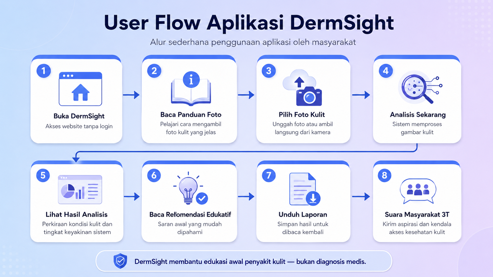
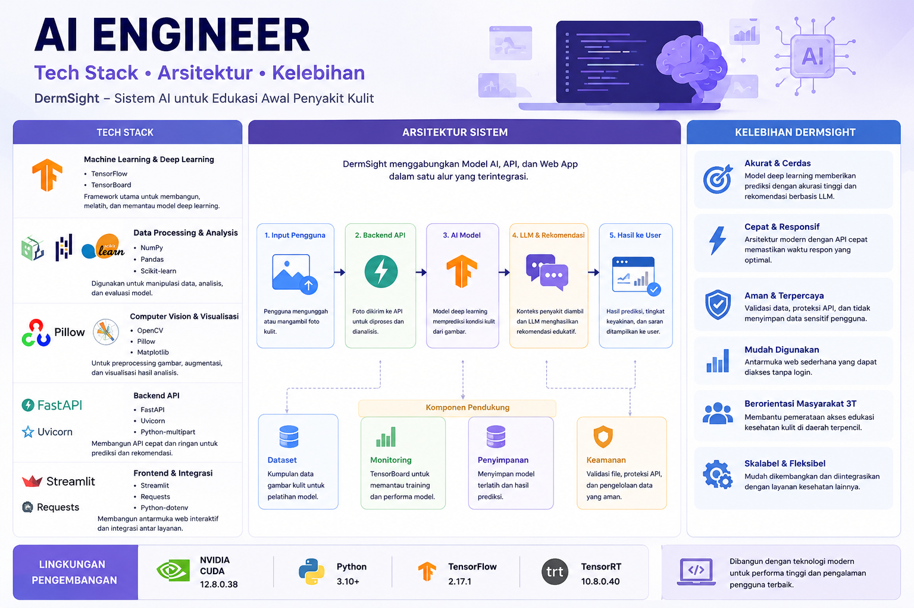
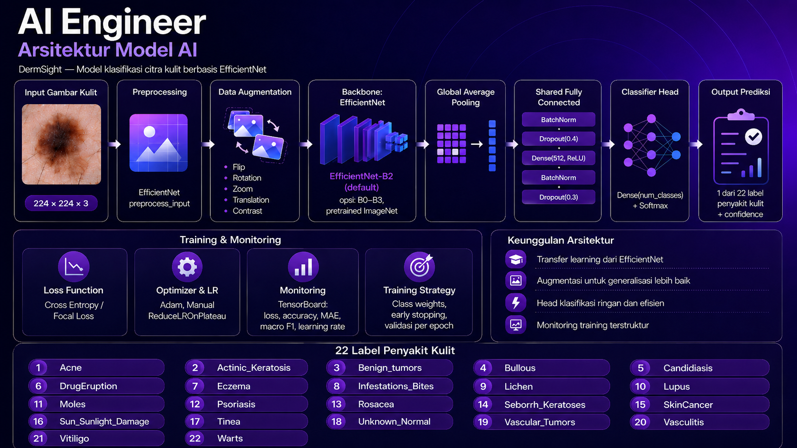
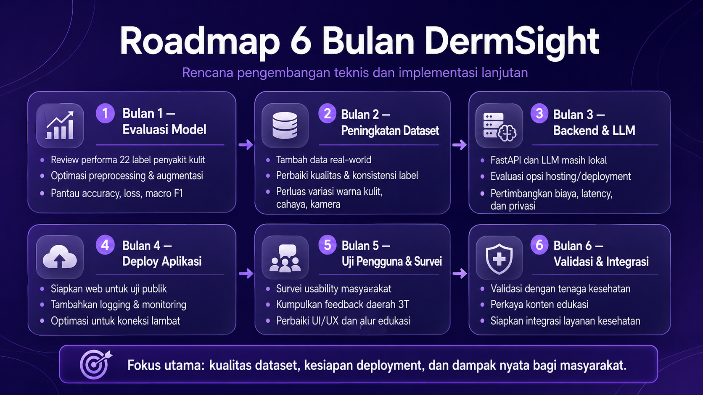

# 🩺 DermSight

## AI-Powered Skin Disease Education Assistant

**DermSight** adalah aplikasi berbasis AI untuk membantu edukasi awal penyakit kulit melalui analisis gambar kulit. Pengguna dapat mengunggah atau mengambil foto kulit, lalu sistem akan memberikan perkiraan kondisi kulit, tingkat keyakinan sistem, dan rekomendasi edukatif berbasis LLM.

> ⚠️ **Disclaimer:** DermSight bukan pengganti diagnosis dokter. Hasil yang diberikan hanya untuk edukasi awal. Jika keluhan kulit memburuk, nyeri, menyebar, berdarah, bernanah, disertai demam, atau tidak membaik, segera konsultasikan ke tenaga kesehatan terdekat.

---

## ✨ Highlight

* 📷 Upload atau ambil foto kulit langsung dari kamera.
* 🧠 Model AI berbasis EfficientNet untuk klasifikasi penyakit kulit.
* 🤖 Rekomendasi edukatif menggunakan LLM.
* 🚀 Backend API menggunakan FastAPI.
* 🌐 Web app interaktif menggunakan Streamlit.
* 📄 Fitur unduh laporan hasil analisis.
* 🗣️ Form **Suara Masyarakat Daerah 3T** untuk mengumpulkan aspirasi dan kendala akses kesehatan kulit.

---

## 🎯 Tujuan Project

DermSight dikembangkan untuk membantu masyarakat mendapatkan edukasi awal mengenai kondisi kulit secara cepat, sederhana, dan mudah digunakan.

Project ini berfokus pada:

1. Membantu masyarakat memahami kemungkinan kondisi kulit dari gambar.
2. Memberikan rekomendasi edukatif yang mudah dipahami.
3. Mendukung akses edukasi kesehatan kulit, terutama untuk masyarakat daerah 3T.
4. Menyediakan sistem AI yang terintegrasi dari model, API, LLM, hingga web interface.

---

## 🖼️ User Flow Aplikasi

Alur penggunaan DermSight dibuat sederhana agar mudah digunakan oleh masyarakat umum.



### Alur Singkat

1. Pengguna membuka website DermSight.
2. Pengguna membaca panduan foto kulit.
3. Pengguna memilih atau mengambil foto kulit.
4. Sistem melakukan analisis gambar.
5. Pengguna melihat hasil analisis.
6. Pengguna membaca rekomendasi edukatif.
7. Pengguna dapat mengunduh laporan.
8. Pengguna dapat mengisi form Suara Masyarakat 3T.

---

## 🧑‍💻 AI Engineer Overview

DermSight menggabungkan beberapa komponen utama, mulai dari model AI, backend API, LLM recommendation, hingga web application.



---

## 🧠 Arsitektur Model AI

Model klasifikasi DermSight menggunakan arsitektur berbasis **EfficientNet** untuk memproses citra kulit.



### Ringkasan Arsitektur

```text
Input Gambar Kulit
        ↓
Preprocessing
        ↓
Data Augmentation
        ↓
EfficientNet Backbone
        ↓
Global Average Pooling
        ↓
Shared Fully Connected Layer
        ↓
Classifier Head
        ↓
Output Prediksi + Confidence
```

### Komponen Model

* **Input size:** 224 × 224 × 3
* **Backbone:** EfficientNet
* **Pretrained weights:** ImageNet
* **Pooling:** Global Average Pooling
* **Regularisasi:** Dropout dan Batch Normalization
* **Output:** Softmax classification
* **Jumlah label:** 22 label penyakit kulit

---

## 🏷️ Label Penyakit Kulit

DermSight saat ini mendukung 22 label klasifikasi penyakit kulit:

| No | Label                 |
| -: | --------------------- |
|  1 | Acne                  |
|  2 | Actinic Keratosis     |
|  3 | Benign tumors         |
|  4 | Bullous               |
|  5 | Candidiasis           |
|  6 | Drug Eruption         |
|  7 | Eczema                |
|  8 | Infestations / Bites  |
|  9 | Lichen                |
| 10 | Lupus                 |
| 11 | Moles                 |
| 12 | Psoriasis             |
| 13 | Rosacea               |
| 14 | Seborrheic Keratoses  |
| 15 | Skin Cancer           |
| 16 | Sun / Sunlight Damage |
| 17 | Tinea                 |
| 18 | Unknown / Normal      |
| 19 | Vascular Tumors       |
| 20 | Vasculitis            |
| 21 | Vitiligo              |
| 22 | Warts                 |

---

## 🧩 Tech Stack

### Machine Learning & Deep Learning

* TensorFlow
* TensorBoard
* NumPy
* Pandas
* Scikit-learn

### Computer Vision & Visualization

* Pillow
* Matplotlib
* OpenCV

### Backend API

* FastAPI
* Uvicorn
* Python Multipart

### Frontend Web App

* Streamlit
* Requests

### Environment & Configuration

* Python Dotenv

---

## 🏗️ Sistem Pipeline

DermSight terdiri dari beberapa pipeline utama:

```text
User
 ↓
Streamlit Web App
 ↓
FastAPI Backend
 ↓
AI Model Prediction
 ↓
Disease Context Retriever
 ↓
LLM Recommendation
 ↓
Result Display + Report Download
```

### 1. Web App

Pengguna mengakses aplikasi melalui Streamlit. Di halaman web, pengguna dapat:

* membaca panduan foto,
* upload foto dari perangkat,
* mengambil foto dari kamera,
* menjalankan analisis,
* melihat hasil prediksi,
* membaca rekomendasi,
* mengunduh laporan,
* mengisi form Suara Masyarakat 3T.

### 2. Backend API

FastAPI digunakan sebagai penghubung antara web app, model AI, dan LLM.

API bertugas untuk:

* menerima gambar dari web app,
* menjalankan preprocessing,
* memanggil model AI,
* mengirim hasil prediksi,
* memanggil layanan rekomendasi LLM.

### 3. AI Model

Model AI memproses gambar kulit dan menghasilkan:

* `predicted_label`
* `confidence`

Output ini digunakan sebagai dasar untuk membuat rekomendasi edukatif.

### 4. LLM Recommendation

Setelah model menghasilkan prediksi, sistem mengambil konteks penyakit yang sesuai. Konteks tersebut kemudian digunakan oleh LLM untuk menghasilkan rekomendasi edukatif.

Rekomendasi tidak dibuat secara hardcoded, tetapi dihasilkan secara dinamis berdasarkan hasil prediksi.

---

## 📁 Struktur Project

Contoh struktur project DermSight:

```text
DermSight/
│
├── api/
│   ├── main.py
│   └── routes/
│
├── llm/
│   ├── ollama_client.py
│   ├── prompts.py
│   └── rag_retriever.py
│
├── src/
│   ├── data/
│   ├── models/
│   ├── training/
│   ├── outputs/
│   └── logs/
│
├── web/
│   └── app.py
│
├── tests/
│
├── utils/
│   └── logger.py
│
├── docs/
│   └── assets/
│       ├── user-flow-dermsight.png
│       ├── ai-engineer-overview.png
│       ├── model-architecture.png
│       └── roadmap-6-months.png
│
├── requirements.txt
├── requirements-container.txt
├── .env.example
├── .gitignore
└── README.md
```

---

## ⚙️ Setup Project

### 1. Clone Repository

```bash
git clone https://github.com/JordanAryaLeksana/DermSight.git
cd DermSight
```

---

### 2. Buat Virtual Environment

#### Windows

```bash
python -m venv venv
venv\Scripts\activate
```

#### Linux / macOS

```bash
python3 -m venv venv
source venv/bin/activate
```

---

### 3. Install Dependencies

```bash
pip install -r requirements.txt
```

Jika menggunakan environment container atau GPU tertentu, gunakan:

```bash
pip install -r requirements-container.txt
```

---

### 4. Buat File Environment

Copy file `.env.example` menjadi `.env`.

```bash
cp .env.example .env
```

Contoh isi `.env`:

```env
DERMSIGHT_API_BASE_URL=http://localhost:8000
DERMSIGHT_ANALYZE_ENDPOINT=/skin/analyze
DERMSIGHT_PREDICT_ENDPOINT=/skin/predict
DERMSIGHT_RECOMMEND_ENDPOINT=/recommendation/generate
```

---

## 🚀 Cara Menjalankan Aplikasi

DermSight membutuhkan dua service utama:

1. **FastAPI Backend**
2. **Streamlit Web App**

---

### 1. Jalankan FastAPI Backend

```bash
uvicorn api.main:app --reload
```

Jika struktur entry point berbeda, sesuaikan dengan file utama FastAPI yang digunakan.

Contoh lain:

```bash
uvicorn src.api.main:app --reload
```

Backend akan berjalan di:

```text
http://localhost:8000
```

---

### 2. Jalankan Streamlit Web App

Buka terminal baru, lalu jalankan:

```bash
streamlit run web/app.py
```

Streamlit biasanya akan berjalan di:

```text
http://localhost:8501
```

---

## 🧪 Mode Analisis

DermSight mendukung dua mode analisis.

### 1. Analyze Langsung

Mode ini mengirim gambar ke satu endpoint dan langsung mendapatkan hasil prediksi serta rekomendasi.

```text
POST /skin/analyze
```

Response yang diharapkan:

```json
{
  "predicted_label": "Acne",
  "confidence": 0.92,
  "recommendation": "..."
}
```

---

### 2. Step-by-Step

Mode ini memisahkan proses prediksi dan rekomendasi.

#### Step 1 — Prediction

```text
POST /skin/predict
```

Response:

```json
{
  "predicted_label": "Acne",
  "confidence": 0.92
}
```

#### Step 2 — Recommendation

```text
POST /recommendation/generate
```

Request:

```json
{
  "predicted_label": "Acne",
  "confidence": 0.92
}
```

Response:

```json
{
  "predicted_label": "Acne",
  "confidence": 0.92,
  "retrieval_result": {
    "matched": true,
    "match_type": "exact",
    "input_label": "Acne",
    "matched_label": "Acne",
    "disease": "Acne",
    "context": "..."
  },
  "recommendation": "..."
}
```

---

## 📊 Training & Monitoring

Training model menggunakan TensorFlow dan dapat dimonitor menggunakan TensorBoard.

### Jalankan TensorBoard

```bash
tensorboard --logdir src/logs
```

Metrik yang dipantau:

* Training loss
* Validation loss
* Training accuracy
* Validation accuracy
* Macro F1
* MAE
* Learning rate

---

## 📄 Output Aplikasi

Setelah analisis selesai, DermSight akan menampilkan:

* Foto yang dianalisis
* Perkiraan kondisi kulit
* Tingkat keyakinan sistem
* Rekomendasi edukatif
* Disclaimer medis
* Tombol unduh laporan

Laporan hasil dapat diunduh dalam format Markdown.

---

## 🗣️ Suara Masyarakat Daerah 3T

DermSight menyediakan form aspirasi masyarakat daerah 3T.

Form ini berfungsi untuk mengumpulkan:

* daerah atau kabupaten pengguna,
* kendala akses kesehatan kulit,
* kebutuhan edukasi,
* pesan tambahan.

Data form disimpan sementara dalam file CSV lokal:

```text
data/suara_masyarakat_3t.csv
```

---

## 🗺️ Roadmap 6 Bulan



### Bulan 1 — Evaluasi Model

* Review performa 22 label penyakit kulit.
* Optimasi preprocessing dan augmentasi.
* Pantau metrik accuracy, loss, dan macro F1.

### Bulan 2 — Peningkatan Dataset

* Tambah data real-world.
* Perbaiki kualitas dan konsistensi label.
* Perluas variasi warna kulit, cahaya, dan kamera.

### Bulan 3 — Backend & LLM

* Evaluasi deployment FastAPI dan LLM.
* Pertimbangkan biaya server, latency, dan privasi.
* Rancang opsi hosting yang lebih stabil.

### Bulan 4 — Deploy Aplikasi

* Siapkan web untuk uji publik.
* Tambahkan logging dan monitoring.
* Optimasi untuk koneksi lambat.

### Bulan 5 — Uji Pengguna & Survei

* Survei usability masyarakat.
* Kumpulkan feedback dari daerah 3T.
* Perbaiki UI/UX berdasarkan masukan pengguna.

### Bulan 6 — Validasi & Integrasi

* Validasi dengan tenaga kesehatan.
* Perkaya konten edukasi.
* Siapkan integrasi dengan layanan kesehatan lokal.

---

## 🔐 Catatan Keamanan dan Privasi

Pengguna disarankan untuk:

* tidak mengunggah foto wajah penuh,
* tidak mengunggah bagian tubuh sensitif,
* tidak mengunggah foto yang memuat identitas pribadi,
* menggunakan aplikasi hanya untuk edukasi awal.

DermSight tidak dimaksudkan untuk menggantikan konsultasi medis profesional.

---

## 🧯 Troubleshooting

### FastAPI tidak bisa diakses

Pastikan backend sudah berjalan:

```bash
uvicorn api.main:app --reload
```

Cek juga konfigurasi `.env`.

---

### Streamlit tidak terbuka

Jalankan ulang:

```bash
streamlit run web/app.py
```

Pastikan Streamlit sudah terinstall:

```bash
pip install streamlit
```

---

### Rekomendasi tidak muncul

Pastikan service LLM sudah berjalan dan endpoint rekomendasi aktif.

---

### Kamera tidak muncul di browser

Pastikan browser memiliki izin untuk menggunakan kamera.

---

### Hasil prediksi tidak muncul

Pastikan:

* gambar sudah dipilih,
* FastAPI aktif,
* model sudah tersedia,
* endpoint sesuai dengan konfigurasi.

---

## 🔗 Important Links

| Kebutuhan              | Link                                             |
| ---------------------- | ------------------------------------------------ |
| Repository             | `https://github.com/JordanAryaLeksana/DermSight` |
| Local FastAPI          | `http://localhost:8000`                          |
| FastAPI Docs           | `http://localhost:8000/docs`                     |
| Local Streamlit        | `http://localhost:8501`                          |
| TensorBoard            | `http://localhost:6006`                          |
| Dataset / Model Output | `src/outputs/`                                   |
| Training Logs          | `src/logs/`                                      |
| Form 3T CSV            | `data/suara_masyarakat_3t.csv`                   |

---

## 🧑‍🔬 Author

**Jordan Arya Leksana**

Project: **DermSight — AI-Powered Skin Disease Education Assistant**

---

## ⚠️ Medical Disclaimer

DermSight bukan pengganti diagnosis dokter. Hasil dari sistem ini hanya digunakan untuk edukasi awal.

Jika keluhan kulit memburuk, nyeri, menyebar, berdarah, bernanah, disertai demam, atau tidak membaik, segera konsultasikan ke dokter atau tenaga kesehatan terdekat.

---

## ⭐ Support

Jika project ini bermanfaat, berikan star pada repository ini untuk mendukung pengembangan DermSight.
